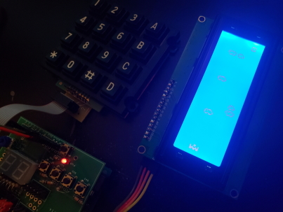

# ArduinoLCDGraphicsLibrary
This is the official git repository for Matthew Holman's ArduinoLCDGraphicsLibrary. It contains the [PlatformIO](https://platformio.org/) directory structure and source code for the project.

This library can be used by the Arduino platform for the purposes of controlling and displaying individual animated characters on multi-line LCD screens. The library also allows for integer values to be displayed in 'portrait' format.

The source code can be found in the `./src/` directory, with `main.cpp` containg a short demo program in the form of a simple game. To run the game, you will require an Arduino Uno board, such as [this one](https://www.amazon.com/Arduino-A000066-ARDUINO-UNO-R3/dp/B008GRTSV6/ref=sr_1_3?dchild=1&keywords=arduino+uno&qid=1615785967&s=electronics&sr=1-3), a 4x4 16-key matrix keypad, such as [this one](https://www.amazon.com/gp/product/B07LCHW8T7/ref=crt_ewc_title_dp_3?ie=UTF8&psc=1&smid=A2RJ79XBQX6W3M), and a 20x4 LCD screen, such as [this one](https://www.amazon.com/gp/product/B071W8SW9R/ref=ppx_yo_dt_b_search_asin_title?ie=UTF8&psc=1). Please note, you may have to reconfigure the `pin_rows` and `pin_columns` arrays in lines `40` and `41` to match the output of your particular 4x4 16-key matrix keypad.

Running
-------

Libraries Used In Demo
----------------------
Keypad
- http://playground.arduino.cc/Code/Keypad

LiquidCrystal_I2C
- https://github.com/johnrickman/LiquidCrystal_I2C